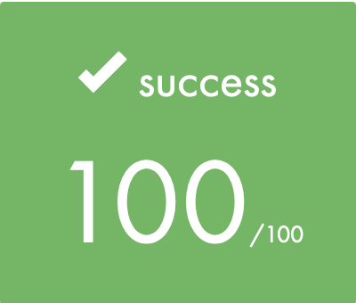

# 🚀 INTRODUCTION

---

The `so_long` project at 42 school challenges students to create a mini game in C language.

Game's goal is very simple, you have a avatar that needs to recover items and exit with a portal to finish the game.

Leveraging the [MiniLibX](https://github.com/42Paris/minilibx-linux) library, this project seamlessly integrates graphics capabilities, providing students with a versatile toolset for creating visually stunning fractal representations.

MLX is a lightweight library designed for simple 2D graphics rendering, offering functions for creating windows, drawing pixels, and handling events like keyboard and mouse input.


# 🛠️  PROGRAM SPECIFICITIES AND CONSIDERATIONS

> [!WARNING]
> This project aims to be executed in a x86 Linux environment, with a QWERTY keyboard.

Start with cloning my repo :
```bash
git clone git@github.com:jotudela/so_long.git && cd so_long
```

Then compile it with :
```bash
make
```

## ⚙️ Usage

So_long need to be executed with one argument.

Example :
-
```bash
  ./so_long maps/map.ber
```


My final grade :




## 🤝 Contribution
Contributions are open, make a pull request or open an issue 🚀
